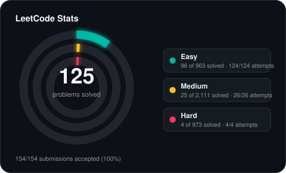
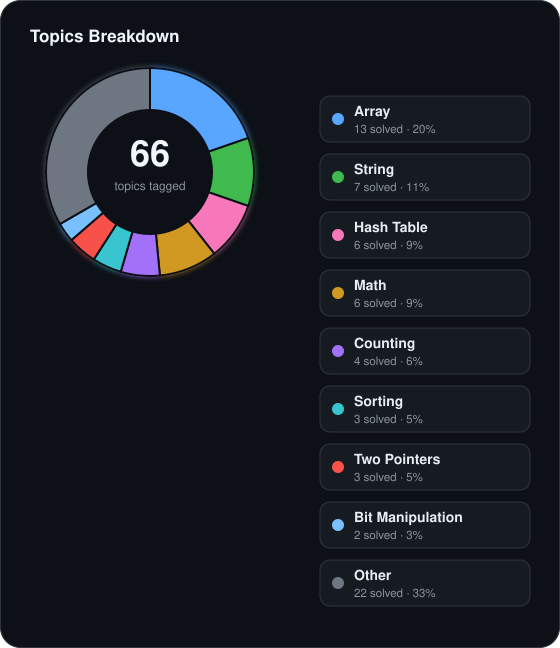

<!-- leetcode-stats:start -->
# LeetCode Solutions

Auto-synced by LeetCode to GitHub Sync.

<!-- leetcode-stats:end -->

| # | Title | Difficulty | Tags | Status |
| --- | --- | --- | --- | --- |
| 1 | [Two Sum](https://leetcode.com/problems/two-sum/) | Easy | Array, Hash Table | ✅ Accepted |<!-- id:two-sum -->
| 136 | [Single Number](https://leetcode.com/problems/single-number/) | Easy | Array, Bit Manipulation | ✅ Accepted |<!-- id:single-number -->
| 451 | [Sort Characters By Frequency](https://leetcode.com/problems/sort-characters-by-frequency/) | Medium | Hash Table, String, Sorting, Heap (Priority Queue), Bucket Sort, Counting | ✅ Accepted |<!-- id:sort-characters-by-frequency -->
| 402 | [Remove K Digits](https://leetcode.com/problems/remove-k-digits/) | Medium | String, Stack, Greedy, Monotonic Stack | ✅ Accepted |<!-- id:remove-k-digits -->
| 9 | [Palindrome Number](https://leetcode.com/problems/palindrome-number/) | Easy | Math | ✅ Accepted |<!-- id:palindrome-number -->
| 27 | [Remove Element](https://leetcode.com/problems/remove-element/) | Easy | Array, Two Pointers | ✅ Accepted |<!-- id:remove-element -->
| 66 | [Plus One](https://leetcode.com/problems/plus-one/) | Easy | Array, Math | ✅ Accepted |<!-- id:plus-one -->
| 26 | [Remove Duplicates from Sorted Array](https://leetcode.com/problems/remove-duplicates-from-sorted-array/) | Easy | Array, Two Pointers | ✅ Accepted |<!-- id:remove-duplicates-from-sorted-array -->
| 13 | [Roman to Integer](https://leetcode.com/problems/roman-to-integer/) | Easy | Hash Table, Math, String | ✅ Accepted |<!-- id:roman-to-integer -->
| 169 | [Majority Element](https://leetcode.com/problems/majority-element/) | Easy | Array, Hash Table, Divide and Conquer, Sorting, Counting, Boyer–Moore Majority Vote Algorithm | ✅ Accepted |<!-- id:majority-element -->
| 58 | [Length of Last Word](https://leetcode.com/problems/length-of-last-word/) | Easy | String | ✅ Accepted |<!-- id:length-of-last-word -->
| 121 | [Best Time to Buy and Sell Stock](https://leetcode.com/problems/best-time-to-buy-and-sell-stock/) | Easy | Array, Dynamic Programming | ✅ Accepted |<!-- id:best-time-to-buy-and-sell-stock -->
| 88 | [Merge Sorted Array](https://leetcode.com/problems/merge-sorted-array/) | Easy | Array, Two Pointers, Sorting | ✅ Accepted |<!-- id:merge-sorted-array -->
| 1394 | [Find Lucky Integer in an Array](https://leetcode.com/problems/find-lucky-integer-in-an-array/) | Easy | Array, Hash Table, Counting | ✅ Accepted |<!-- id:find-lucky-integer-in-an-array -->

